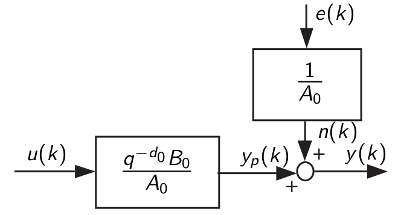
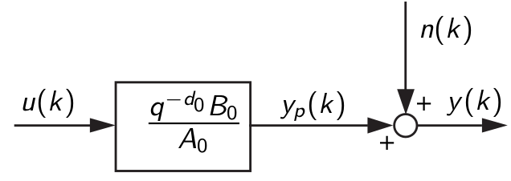
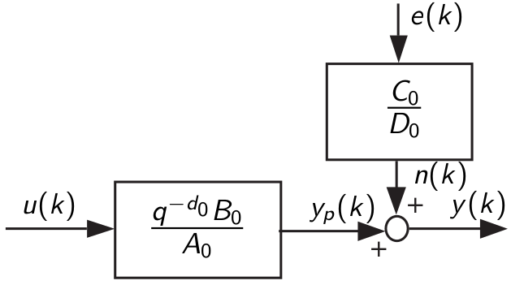
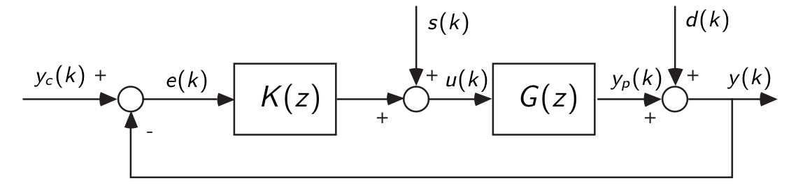

== System Identification - Exam Questions
:stem: latexmath

=== 1. Compare impulse, step, sum of sinusoids, discrete random processes and PRBS signals in terms of their spectra and their degrees of excitation.

* *Impulse*: Constant 1 spectrum and excitation in all frequencies,
infinite degree of excitation. The signal has very low energy as it
inputs zero energy everywhere except at latexmath:[k=0].
* *Step*: In theory the degree of excitation is also infinite. However, the step signal puts more energy in low frequency and the energy per frequency quickly decays over the frequency axis. In consequence if a system is excited by a step signal, very low frequencies and the DC part are strongly excited while high frequency are approximately not excited at all.
* *Sum of Sinusoids*: The degree of excitation is n, where n is the number of sinusoids summed. The spectrum is discrete and hand specific peaks at the frequencies of the summed sinusoids.
* *Discrete Random Processes*: Discrete random processes have also infinite degree of excitation as the spectrum is continuous. The spectrum depends on the covariance of the noise.
* *PRBS*: The signal is periodic and the spectrum is therefore discrete and the degree of excitation is finite. The spectrum of a pure (non-divided) PRBS signal is flat and it can be shaped using frequency dividers.

=== 2. How can we find the impulse response of a system using the correlation approach?

The system is excited with a suitable input signal and the response of the system is recorded. Then, the autocorrelation of the input signal and the cross-correlation of the input and response signal is estimated.
In order to compute the estimate for the impulse response latexmath:[g(h)], one of the following approaches is used dependent on whether the input signal is white or not.
For white noise latexmath:[g(h) = \frac{\hat{R}_{yu}(h)}{\hat{R}_{uu}(0)}], else if the input signal is not white numerical deconvolution using the following relation:
[latexmath]
+++++++++++
R_{yu}(h) = \sum\limits_{j=0}^{K-1} g(j) R_{uu}(h - j)
+++++++++++
In the above equations latexmath:[\hat{R}_{uu}] denote the estimated autocorrelation of the input signal and latexmath:[\hat{R}_{yu}] denotes the estimated cross-correlation between the input and output signal.

=== 3. How is a PRBS generated? What is the period of a PRBS? How can its richness at low frequencies be improved?

image:prbs.png[PRBS]

the (maximum) period is latexmath:[M = 2^n - 1]. For richer signal at low frequencies: add a frequency divider between the PRBS generator and the test system.

=== 4. Explain the principle of bias-variance trade-off in estimation problems.

The bias-variance trade-off is present in all estimation problems with noisy data. Basically, the intuition is when the model capacity is low (low amount of parameters) the model has not enough capacity to fit the data and there will be always some error due to the modelling with a low capacity model called *bias*. At the same time for reasonable assumptions on the noise the variance of the parameter estimates will be low as the system will be highly overdetermined. On the other hand, when the model capacity is large, the model has enough capacity to fit the data and the bias is low.
However, at larger model capacities also the *variance* in the parameter estimates is higher as the estimates stronger respond to the noise realization. We can decompose the fit-error into variance, bias and noise, where bias and variance depend on the model chosen and the noise term is constant.

By increasing the number of parameters the bias error is decreased but the variance error augments. Therefore, having a small bias may lead to a better MSE.

=== 5. Explain the principle of Fourier analysis. Name three major errors in Fourier analysis. Explain how the truncation error can be reduced.

The objective of Fourier analysis is to identify the frequency response latexmath:[G(j\omega)] of the test system. Therefore, test signal is applied to the test system and the recorded system response is analyzed.
[latexmath]
+++++++++++
G(j\omega) = \frac{Y(j\omega)}{U(j\omega)}
+++++++++++

==== Errors are:
* *Sampling Error:* we identify latexmath:[G(e^{j\omega})] instead of latexmath:[G(j\omega)]
* *Measurement Error:* the measured output is not the true output
* *Truncation Error:* The Fourier transform uses and infinite sum. We use a finite one.

==== Reduction of Truncation Error
* excitation with energy signal and wait for transience to vanish after the end of the signal
* periodic signal -> no truncation error
* windowing

=== 6. Explain how the frequency response can be identified using the spectral analysis method. How can the estimates be improved by averaging? How can the estimates be improved with windowing? Discuss the choice of the window's width.

In contrast to the Fourier analysis, the spectral analysis method is not based on the Fourier transforms of the in- and output signal, but on their auto- and cross-correlation function, respectively. So in other word the power spectral densities are used in order to estimate the frequency response of the test system using the relation
[latexmath]
+++++++++++
G(e^{j\omega_n}) = \frac{\Phi_{yu}(\omega_n)}{\Phi_{uu}(\omega_n)}
+++++++++++
where latexmath:[\Phi_{yu}(\omega_n) = \sum\limits_{h=0}^{N-1} \hat{R}_{yu} e^{-jh \frac{2\pi n}{N}}] for latexmath:[\omega_n = \frac{n \omega_s}{N}].

By using less frequency bins, the available data can be split to compute the less-resolution outcome of the spectral analysis of subsequences of the data. Then, the results of multiple runs can be averaged to reduce the effect of noise. Averaging is done on the power spectral density functions, no on latexmath:[G(e^{j\omega})]. The estimates of the auto- and cross-correlation functions are usually the more inaccurate the more you move away from h=0. Therefore, a windowing function filtering out the less-accurate parts of the correlation functions can be used to improve the results of the spectral analysis method. The window should b as small as possible to filter out the inaccurate parts, but not too small to minimize the effect of spectrum-smearing by the Fourier-transform of the window.

=== 7. Why are we interested in closed-loop identification? What is the major problem? How can a good model be obtained by spectral analysis?
There are certain points why we would perform a closed-loop identification. There is a class of instable systems that is stabilized in closed-loop operation with a controller. (Think of applying PRBS in open-loop operation to an inverse pendulum ;)) Also, there exist systems with integrators creating an output drift in open-loop. Also, when identifying a system in closed-loop it is excited in the frequencies relevant for controller design, so we concentrate the frequency distribution of the system excitation during data acquisition in the relevant region, automatically.

The main problem in closed-loop is, that the input of the test system is correlated with feedback and spectral analysis can therefore not be applied directly.
The identified model resulting from closed-loop identification may be appropriate for controller design, but in general it might not be very useful for other tasks like simulation or gaining physical insight in the model structure.

=== 8. Define the ARX structure with a block diagram. Discuss its properties (fit criterion, biasedness, optimization, bias distribution).

the ARX model assumes a system transfer function of the form latexmath:[\frac{q^{-1} B(q^{-1})}{A(q^{-1})}] and a filtered white noise, filtered by latexmath:[\frac{1}{A(q^{-1})}]. The ARX predictor is then
[latexmath]
+++++++++++
\hat{y}(k, \theta) = -a_1 y(k-1) - \ldots - a_n y(k-n) + b_1 u(k-d-1) + \ldots + b_m (k-d-m) = \phi^\top (k) \theta
+++++++++++
and we have the general least squares fit criterion
[latexmath]
+++++++++++
J(\theta) = \sum\limits_{k=1}^{N} [y(k) - \hat{y}(k, \theta)]^2 .
+++++++++++
And therefore only a linear least squares objective is to be solved.

Usually, the estimates obtained by ARX are biased as the noise model is not applicable in most of the cases. ARX only gives unbiased estimates if the noise model latexmath:[n(k) = \frac{e(k)}{A(q^-1)}] is present in the system structure or if the instrumental variables method (IV) is used in order to obtain asymptotically unbiased estimates.
If the system to be identified implements the ARX structure, the ARX method will result in asymptotically unbiased estimates.

ARX assumes that the noise model is latexmath:[H_0 (q^{-1}) = \frac{1}{A(q^{-1})}].

If the model assumptions on the plant model latexmath:[G(s)] and the noise model latexmath:[H(s)] are not correct, the ARX structure will of course yield a biased estimate.
Analysis the bias-distribution of the ARX model shows that the bias is distributed according to the inverse of the noise model latexmath:[H = \frac{1}{A}]. As physical systems usually show low-pass behavior, the bias distribution has the shape of a high-pass filter and thus the bias is more in low-frequencies while high-frequencies are more accurate.
In order to overcome this often unintended outcome, the data can be filtered by the inverse of the noise model and compute the ARX identification once again.

=== 9. Define the ARMAX structure with a block diagram. Discuss its properties (fit criterion, biasedness, optimization, bias distribution).

The ARMAX scheme is similar to the ARX model, except that the noise model transfer function now has also a numerator polynomial.
As for the ARX model, when the system to be identified implements the ARMAX structure, ARMAX yield asymptotically unbiased estimates. Usually, ARMAX is well-suited for systems, where the noise is applied to the input of the system.
The optimization objective is non-linear in the model parameters, so ARMAX cannot be solved using linear least squares and an iterative approach is employed. This comes with the risk of converging to a local optimum.
The bias-distribution depends on whether the models for the plant and the noise match the true system.
If the noise model is not chosen properly, that is the true system is never expressible by the noise model for any choice of the parameters, then also the plant model is biased.

=== 10. Define the OE structure with a block diagram. Discuss its properties (fit criterion, biasedness, optimization, bias distribution).

The output error (OE) structure does not include any assumption on the noise model. The system model is as before described by a transfer function of the form latexmath:[\frac{q^{-d}B(q^{-1})}{A(q^{-1})}]. The noise is modeled by a term latexmath:[n(k)] without further assumptions on whiteness or frequency spectrum.
The optimization objective of the output error structure is nonlinear and numerical optimization methods need to be used.
Note that there is no guarantee to converge to the global optimum.

The bias is distributed according to the spectrum of the input excitation signal. When bias distribution needs to be shaped one can change the excitation signal or filter the in- and output signal after recording.

=== 11. Define the BJ structure with a block diagram. Discuss its properties (fit criterion, biasedness, optimization, bias distribution).

The Box-Jenkins structure has again a noise model, but does share the denominator of the noise transfer function with the denominator of the plant transfer function. The plant model is still expressed by the transfer function latexmath:[\frac{q^{-d}B(q^{-1})}{A(q^{-1})}], while the noise model is not expressed by the transfer function latexmath:[\frac{C(q^{-1})}{D(q^{-1})}].
The Box-Jenkins fit criterion is also non-linear in the model parameters and numerical solver need to be employed including the risk of converging to a local minimum.

As the Box-Jenkins model completely decouples the noise model and plant model such that they do not have shared parameters.
Therefore an inappropriate choice of the noise model does not lead to a biased estimated of the plant model.

=== 12. Explain the principle of the IV method to obtain asymptotically unbiased estimates. How can the IV vector be chosen?

=== 13. Explain the different steps of the state-space identification method: when are the states measured and when are they estimated using the subspace projection method.

There are different strategies for state-space identification. First let's consider that we have the state latexmath:[x(k)] available either because their measured or by other magical reasons. Then, we can rewrite the well-known state-space model
[latexmath]
+++++++++++
x(k+1) = Ax(k) + Bu(k) + w(k)
+++++++++++
[latexmath]
+++++++++++
y(k) = Cx(k) + Du(k) + e(k)
+++++++++++
into a single expression
[latexmath]
+++++++++++
Y(k) = \Theta \varphi (k) + E(k)
+++++++++++
where
[latexmath]
+++++++++++
Y(k) = \begin{bmatrix}x(k+1)\\y(k)\end{bmatrix} \qquad \Theta = \begin{bmatrix}A&B\\C&D\end{bmatrix} \, .
+++++++++++
This expression can be solved in a regular least-squares framework.

However, usually the states latexmath:[x(k)] are not available and we need to estimate the states as well.
A state vector contains the information needed to compute future outputs if the inputs are known. Therefore, we can use some combination of future outputs in order to get a state representation. As the the state-space representation is not unique, we can use an arbitrary linear combination of the future outputs. Let the system order be n, then the amount of future outputs considered for the state estimation will be n as well. Formally
[latexmath]
+++++++++++
x(k) = L \begin{bmatrix}\hat{y}(k+1)\\\hat{y}(k+2)\\\vdots \\\hat{y}(k+n)\end{bmatrix}.
+++++++++++
The choice of L is arbitrary, but should regular. Given that the state sequence latexmath:[x(k)] was computed using this method, the aforementioned least-squares predictor can be used to estimate the state-space model expressed by the matrices A, B, C and D.

=== 14. Explain the different steps of the subspace identification method based on the observability matrix: estimation of the extended observability matrix, estimation of the order n, the matrices A and C, and estimation of B and D.

The subspace identification method is a method to estimated a state-space model of a system, when no states are measured and only a sequence of inputs latexmath:[u(k)] and outputs latexmath:[y(k)] is available. It used an estimate of the observability matrix to firstly estimate the system matrix A and the output matrix C and then estimates the matrices B and D using the estimates latexmath:[\hat{A}] and latexmath:[\hat{C}].

The observability matrix has the following shape
[latexmath]
+++++++++++
O_r = \begin{bmatrix} C\\CA\\CA^{2}\\\vdots \\ CA^{r-1}\end{bmatrix}_{rn_y \times n}
+++++++++++
Given the measured output latexmath:[y(k)] and the input sequence latexmath:[u(k)] construct the vectors
[latexmath]
+++++++++++
Y_r(k) = \begin{bmatrix}y(k)\\y(k+1)\\\vdots \\y(k+r-1)\end{bmatrix} \text{ and } U_r(k) = \begin{bmatrix}u(k)\\u(k+1)\\\vdots \\ u(k+r-1)\end{bmatrix}
+++++++++++
and assemble them into matrices
[latexmath]
+++++++++++
\mathbf{Y} = \begin{bmatrix}Y_r(0)&Y_r(1)&\ldots&Y_r(N)\end{bmatrix} \text{ and } \mathbf{U} = \begin{bmatrix}U_r(0)&U_r(1)&\ldots&U_r(N)\end{bmatrix}.
+++++++++++

Then constructing the orthogonal matrix latexmath:[\mathbf{U}^\perp = \mathbf{I} - \mathbf{U}^\top (\mathbf{UU}^\top)^{-1} \mathbf{U}] and using the relation latexmath:[Y_r(k) = O_rx(k) + S_r U_r(k)] we can compute the extended observability matrix latexmath:[\mathbf{Q} = \mathbf{YU}^\perp]. Then the rank of Q can be estimated in order to estimate the order of the system. For instance SVD can be used to estimate the rank. The estimate of the observability matrix latexmath:[O_r] are then the fist n columns of latexmath:[\mathbf{Q}], where n is the estimated order of the system. Using the formula for the observability matrix, estimates for the matrices A and C can be extracted from latexmath:[O_r].

Now, suppose that the estimates latexmath:[\hat{A}] and latexmath:[\hat{C}] are already available. The output predictor using the identified matrices is
[latexmath]
+++++++++++
\hat{y}(k) = \hat{C}(qI - \hat{A})^{-1} B u(k) + Du(k) = \begin{bmatrix}B^\top & D\end{bmatrix} \begin{bmatrix}u_f^\top(k)\\u(k)\end{bmatrix} = \theta^\top \varphi(k)
+++++++++++
which can than be solved for B and D (latexmath:[\theta]) in the least-squares fashion.

=== 15. Explain the Gauss-Newton method for minimization of the fit criterion.

If the objective is not linear, no closed-form solution of the fit criterion is available and iterative methods can be used. The Gauss-Newton algorithm is one such method and uses a second order approximation of the function at the current position of the estimate. Then, the parameter vector latexmath:[\hat{\theta}_i] is iteratively updated. The Gauss-Newton sets the new parameter vector to the apex of the approximating parabola. Therefore, the first derivative (gradient) and the second derivative (Hessian) are used in order to compute the update as follows
[latexmath]
+++++++++++
\hat{\theta}_{i+1} = \hat{\theta}_i - [J''(\hat{\theta}_i)]^{-1} J'(\hat{\theta}_i)
+++++++++++
as this approach iteratively updates the parameter estimate latexmath:[\hat{\theta}_i], an initial condition latexmath:[\hat{\theta}_0] is required. Usually, the least-squares estimate of a similar fit-criterion is used.

=== 16. Explain the pseudo linear regression algorithm to solve nonlinear optimization problems.

For nonlinear optimization problems (e.g. for ARMAX, BJ) the estimate for the parameter vector latexmath:[\hat{\theta}] cannot be computed in a closed form fashion as for linear problems such as the ARX objective.
One technique is to use pseudo-linear regression, which can be written in the following structure:

[latexmath]
+++++++++++
\hat{\theta}_{i+1} = \left[\sum\limits_{k=1}^N \phi(k, \hat{\theta}_i ) \phi^\top(k, \hat{\theta}_i )\right] \left[\sum\limits_{k=1}^N \phi(k, \hat{\theta}_i ) y(k)\right],
+++++++++++
which looks like a linear least squares solution, but note that the right hand side depends on the parameter vector latexmath:[\hat{\theta}_i]. Now, the idea is to initialize the parameter vector latexmath:[\hat{\theta}_0], e.g. by using a simple least squares model as ARX and then iterate the update rule above until convergence.

=== 17. Explain the principles of the recursive identification algorithms. What is the forgetting factor?

Recursive identification algorithms are used when the parameters are computed online while the data is acquired. That is, while the data is measured we would like to continuously update our estimate for the model parameters. Consider the least squares solution

[latexmath]
+++++++++++
\hat{\theta} = \left[\sum\limits_{k=1}^N \phi(k) \phi^\top(k)\right]^{-1} \left[\sum\limits_{k=1}^N \phi(k) y(k)\right]
+++++++++++

over the time the number of samples latexmath:[N] grows as samples are continuously collected. Each time step the latexmath:[p \times p] matrix must be inverted, where p is the number of parameters. The objective the recursive algorithms is to maintain an up-to-now estimate of the parameters and update it accordingly when a new sample arrives. The advantage is, that in order to compute the estimate at timestep t only the last parameter estimate and the new data are required, not all the past data back to latexmath:[t=0]. The recursive formulation maintains an estimate of the parameters at timestep k denoted latexmath:[\hat{\theta}_k] and the information matrix at timestep k latexmath:[P_{k}^{-1}]. The informations is proportional to the covariance matrix of the parameter estimates meaning that we get an (un)certainty measure for free. In other words by looking at latexmath:[P_k^{-1}] at timestep k, we get some measure on how certain we are about the identified parameters. Based on the closed-form solution for the least squares objective we can derive the following recursive update pattern

[latexmath]
+++++++++++
P_{k+1}^{-1} = P_k^{-1} + \phi(k+1) \phi^\top(k+1)
+++++++++++
and

[latexmath]
+++++++++++
\hat{\theta}_{k+1} = \hat{\theta}_{k} + P_{k+1} \phi(k+1) \left[y(k+1) - \phi^\top (k+1) \hat{\theta}_k\right]\, .
+++++++++++

Using the matrix inversion lemma, one can also get rid of the inversion of the information matrix and directly keep the proportional of covariance term.

==== Forgetting Factor

It can be shown that the trace of the information matrix latexmath:[P_{k+1}] will converge to zero and therefore, the adaptation gain will be almost zero after some time. In other words after some time we not follow changes in the system parameters anymore. In order to use the system for online identification of time-varying systems, a _forgetting factor_ latexmath:[\lambda] should be introduced. The forgetting factors gives more importance to the most recent samples and less importance to older data. The forgetting factors effects the update of the information matrix

[latexmath]
+++++++++++
P_{k+1}^{-1} = \lambda P_{k}^{-1} + \phi(k+1) \phi^\top (k+1)
+++++++++++

When we are at timestep k, the sample at time k is weights by latexmath:[\lambda^0 = 1] and the sample h times ago is weighted by latexmath:[\lambda^h]. Usually, the forgetting factor is set such that latexmath:[0.9 \le \lambda \le 0.99].

=== 18. Explain what the bias distribution is and why it is important.

Bias-distribution refers to the fact that for parametric identification method the bias is not equally distributed among frequencies. Depending on the model structure and the algorithm the bias may occur mainly at different frequencies or is uniformly distributed. The bias-distribution is an important quality factor of a identified parametric model. The bias should be as low as possible in the frequencies region relevant for controller design.

=== 19. Explain the direct and indirect methods for closed-loop identification.

There are two main techniques for close-loop identification:

==== Direct Method
The system is excited with an external signal at the input of the plant latexmath:[u(k)] and the output latexmath:[y(k)] and an open-loop identification method is applied on the close-loop data. The problem is that we have correlation of the input signal with noise (through the controller). For the methods with noise model, we can adapt the noise model to latexmath:[H = H_0 (1 + KG_0)^{-1}] -> requires an higher order noise model and the noise should be small. Box-Jenkins should be used. *IV is very well suited for direct identification in closed-loop operation* as it aims to remove the correlation.

==== Indirect Method
The indirect methods identifies the closed-loop system as a whole and a single black box. So in fact the the closed dynamics

[latexmath]
+++++++++++
	\mathcal{T}(q^{-1}) = \frac{K(q^{-1}) G_0(q^{-1})}{1 + K(q^{-1}) G_0(q^{-1})}
+++++++++++
is identified instead of the desired plant model latexmath:[G_0]. Given that the controller transfer function latexmath:[K] is known, the plant dynamics can be reconstructed from identified closed-loop transfer function
[latexmath]
+++++++++++
	G(q^{-1}) = \frac{\mathcal{T}(q^{-1})}{K(q^{-1})(1 + \mathcal{T}(q^{-1}))}
+++++++++++

=== 20. What is the cross-correlation test? What is the whiteness test? How are the confidence intervals computed?

The cross-correlations and the whiteness test are validation methods for identified parametric model.

==== Cross-Correlation Text
The intuition is that the residual latexmath:[\epsilon(k, \hat{\theta})] should contain any information of the system and should be therefore uncorrelated with past inputs. If there is a correlation between the residual and the past input this would mean that parts of the system are unmodelled and shape the noise instead. For the cross-correlation test, an estimate for the cross-correlation between the residual and the input signal latexmath:[\hat{R}_{\epsilon u}(h)] is computed. The cross-correlation should be small (zero in theory) in order to validate the model. In practice a statistical test with a 95% confidence interval is used and the values for the cross-correlation must lie within a certain interval dependent on the level on the confidence interval.

==== Whiteness Test
For the models with noise model (ARX, ARMAX and Box-Jenkins) the assumption is that the system noise is a white noise filtered by some transfer function latexmath:[H(q^{-1})]. therefore the residual latexmath:[\epsilon (k, \hat{\theta}) = y(k) - \hat{y}(k, \hat{\theta})] should be white if the parameters are identified correctly and the true system can be (approximately) modeled as ARX, ARMAX or BJ system. The whiteness test checks the whiteness of the residual by computing the autocorrelation of latexmath:[\epsilon]. If the outcome is white enough (meaning that a white residual would have produced the residual we have by a percentage of 95%), the model is validated under the whiteness test.
