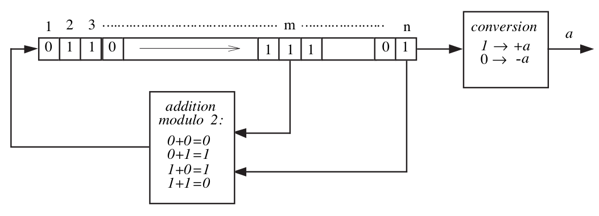

== System Identification - Exam Questions
:stem: latexmath

=== 1. Compare impulse, step, sum of sinusoids, discrete random processes and PRBS signals in terms of their spectra and their degrees of excitation.

* *Impulse*: Constant 1 spectrum and excitation in all frequencies,
infinite degree of excitation. The signal has very low energy as it
inputs zero energy everywhere except at latexmath:[k=0].
* *Step*: In theory the degree of excitation is also infinite. However, the step signal puts more energy in low frequency and the energy per frequency quickly decays over the frequency axis. In consequence if a system is excited by a step signal, very low frequencies and the DC part are strongly excited while high frequency are approximately not excited at all.
* *Sum of Sinusoids*: The degree of excitation is n, where n is the number of sinusoids summed. The spectrum is discrete and hand specific peaks at the frequencies of the summed sinusoids.
* *Discrete Random Processes*: Discrete random processes have also infinite degree of excitation as the spectrum is continuous. The spectrum depends on the covariance of the noise.
* *PRBS*: The signal is periodic and the spectrum is therefore discrete and the degree of excitation is finite. The spectrum of a pure (non-divided) PRBS signal is flat and it can be shaped using frequency dividers.

=== 2. How can we find the impulse response of a system using the correlation approach?

The system is excited with a suitable input signal and the response of the system is recorded. Then, the autocorrelation of the input signal and the cross-correlation of the input and response signal is estimated.
In order to compute the estimate for the impulse response latexmath:[g(h)], one of the following approaches is used dependent on whether the input signal is white or not.
For white noise latexmath:[g(h) = \frac{\hat{R}_{yu}(h)}{\hat{R}_{uu}(0)}], else if the input signal is not white numerical deconvolution using the following relation:
[latexmath]
+++++++++++
R_{yu}(h) = \sum\limits_{j=0}^{K-1} g(j) R_{uu}(h - j)
+++++++++++
In the above equations latexmath:[\hat{R}_{uu}] denote the estimated autocorrelation of the input signal and latexmath:[\hat{R}_{yu}] denotes the estimated cross-correlation between the input and output signal.

=== 3. How is a PRBS generated? What is the period of a PRBS? How can its richness at low frequencies be improved?

the (maximum) period is latexmath:[M = 2^n - 1]. For richer signal at low frequencies: add a frequency divider between the PRBS generator and the test system.

=== 4. Explain the principle of bias-variance trade-off in estimation problems.

The bias-variance trade-off is present in all estimation problems with noisy data. Basically, the intuition is when the model capacity is low (low amount of parameters) the model has not enough capacity to fit the data and there will be always some error due to the modelling with a low capacity model called *bias*. At the same time for reasonable assumptions on the noise the variance of the parameter estimates will be low as the system will be highly overdetermined. On the other hand, when the model capacity is large, the model has enough capacity to fit the data and the bias is low.
However, at larger model capacities also the *variance* in the parameter estimates is higher as the estimates stronger respond to the noise realization. We can decompose the fit-error into variance, bias and noise, where bias and variance depend on the model chosen and the noise term is constant.

=== 5. Explain the principle of Fourier analysis. Name three major errors in Fourier analysis. Explain how the truncation error can be reduced.

=== 6. Explain how the frequency response can be identified using the spectral analysis method. How can the estimates be improved by averaging? How can the estimates be improved with windowing? Discuss the choice of the window's width.

=== 7. Why are we interested in closed-loop identification? What is the major problem? How can a good model be obtained by spectral analysis?

=== 8. Define the ARX structure with a block diagram. Discuss its properties (fit criterion, biasedness, optimization, bias distribution).

=== 9. Define the ARMAX structure with a block diagram. Discuss its properties (fit criterion, biasedness, optimization, bias distribution).

image:armax.png[ARMAX]

=== 10. Define the OE structure with a block diagram. Discuss its properties (fit criterion, biasedness, optimization, bias distribution).

=== 11. Define the BJ structure with a block diagram. Discuss its properties (fit criterion, biasedness, optimization, bias distribution).

image:bj.png[BJ]

=== 12. Explain the principle of the IV method to obtain asymptotically unbiased estimates. How can the IV vector be chosen?

=== 13. Explain the different steps of the state-space identification method: when are the states measured and when are they estimated using the subspace projection method.

=== 14. Explain the different steps of the subspace identification method based on the observability matrix: estimation of the extended observability matrix, estimation of the order n, the matrices A and C, and estimation of B and D.

=== 15. Explain the Gauss-Newton method for minimization of the fit criterion.

=== 16. Explain the pseudo linear regression algorithm to solve nonlinear optimization problems.

=== 17. Explain the principles of the recursive identification algorithms. What is the forgetting factor?

=== 18. Explain what the bias distribution is and why it is important.

=== 19. Explain the direct and indirect methods for closed-loop identification.

=== 20. What is the cross-correlation test? What is the whiteness test? How are the confidence intervals computed?
