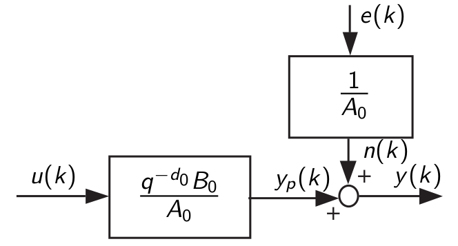
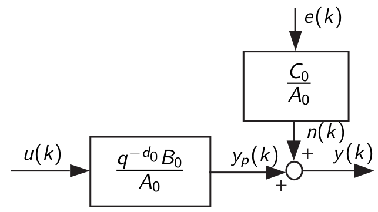
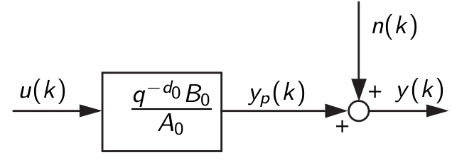

# System Identification - Exam Questions

## 1. Compare impulse, step, sum of sinusoids, discrete random processes and PRBS signals in terms of their spectra and their degrees of excitation.

- __Impulse__: Constant 1 spectrum and excitation in all frequencies, infinite degree of excitation. The signal has very low energy as it inputs zero energy everywhere except at $`k=0`$.

## 2. How can we find the impulse response of a system using the correlation approach?

## 3. How is a PRBS generated? What is the period of a PRBS? How can its richness at low frequencies be improved?

## 4. Explain the principle of bias-variance trade-off in estimation problems.

## 5. Explain the principle of Fourier analysis. Name three major errors in Fourier analysis. Explain how the truncation error can be reduced.

## 6. Explain how the frequency response can be identified using the spectral analysis method. How can the estimates be improved by averaging? How can the estimates be improved with windowing? Discuss the choice of the window's width.

## 7. Why are we interested in closed-loop identification? What is the major problem? How can a good model be obtained by spectral analysis?

## 8. Define the ARX structure with a block diagram. Discuss its properties (fit criterion, biasedness, optimization, bias distribution).

## 9. Define the ARMAX structure with a block diagram. Discuss its properties (fit criterion, biasedness, optimization, bias distribution).

## 10. Define the OE structure with a block diagram. Discuss its properties (fit criterion, biasedness, optimization, bias distribution).

## 11. Define the BJ structure with a block diagram. Discuss its properties (fit criterion, biasedness, optimization, bias distribution).

## 12. Explain the principle of the IV method to obtain asymptotically unbiased estimates. How can the IV vector be chosen?

## 13. Explain the different steps of the state-space identification method: when are the states measured and when are they estimated using the subspace projection method.

## 14. Explain the different steps of the subspace identification method based on the observability matrix: estimation of the extended observability matrix, estimation of the order n, the matrices A and C, and estimation of B and D.

## 15. Explain the Gauss-Newton method for minimization of the fit criterion.

## 16. Explain the pseudo linear regression algorithm to solve nonlinear optimization problems.

## 17. Explain the principles of the recursive identification algorithms. What is the forgetting factor?

## 18. Explain what the bias distribution is and why it is important.

## 19. Explain the direct and indirect methods for closed-loop identification.

## 20. What is the cross-correlation test? What is the whiteness test? How are the confidence intervals computed?
